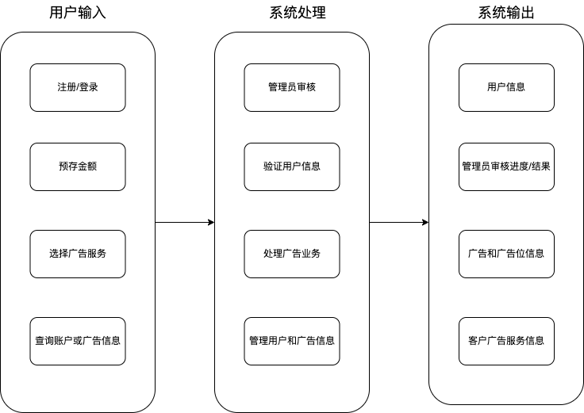
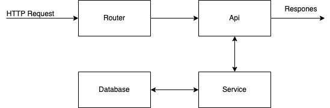
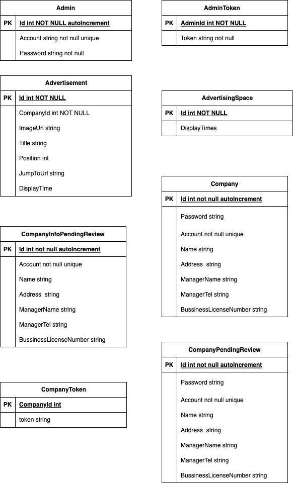

# 系统设计文档

~~（如果图片显示失败可以点击链接）~~

## 组件设计

[如图所示](Architenture.png)

## 组件接口设计

[如图](./pic/ComponentInterfaceDesign.png)

1. 后端通过`Router`对接收到的`HTTP Request`进行分流，并且调用`Api`
2. `Api`对`HTTP Request`的`payload`进行简单解析，转化成参数，调用`Service`进行处理
3. `Service`对于传入的参数进行处理，有必要可以对数据库进行处理（包括读写数据库），执行过程会进行错误处理，最后会把处理结果返回给`Api`
4. `Api`对`Service`的返回值进行处理，决定`Respones`的类型以及内容，然后返回请求者

## 数据库设计

[ER图如下](./pic/DatabaseDesign.png)

1. Admin（管理员）
   - `Id` 管理员id
   - `Account` 管理员账号
   - `Password`管理员密码

2. AdminToken（管理员`JWT` token）

   - `AdminId` `JWT`对应的管理员id
   - `Token`     `JWT Token`

3. Advertisement （广告）

   - `Id` 广告id
   - `CompanyId` 公司id
   - `ImageUrl`  广告图片的url
   - `Title` 广告标题
   - `Position` 广告位置
   - `JumpToUrl` 广告跳转的url
   - `DisplayTime` 广告的显示时间

4. AdvertisingSpace （广告位）

   - `Id` 广告位的id
   - `DisplayTimes` 广告位展示的时间段

5. Company （公司）

   - `Id`	公司id
   - `Password` 公司的帐号的密码
   - `Account`   公司账号
   - `Name     `  公司名称
   - `Address  ` 公司地址
   - `ManagerName ` 公司经理姓名
   - `ManagerTel` 经理电话
   - `BusinessLicenseNumber` 商业许可证

6. CompanyInfoPendingReview （提交修改信息后等待审核的公司）

   - `Id`	提交修改信息后等待审核的公司的id
   - `Account`   提交修改信息后等待审核的公司的帐号
   - `Name     `  提交修改信息后等待审核的公司的名称
   - `Address  ` 提交修改信息后等待审核的公司的地址
   - `ManagerName ` 提交修改信息后等待审核的公司的经理姓名
   - `ManagerTel` 提交修改信息后等待审核的公司的经理电话
   - `BusinessLicenseNumber` 提交修改信息后等待审核的公司的商业许可证

7. CompanyPendingReview （注册后等待审核的公司）

   与 Company 完全相同

8. CompanyToken （公司`JWT` Token）
   - `CompanyId` `JWT`对应的公司id 
   - `Token` `JWT Token`
